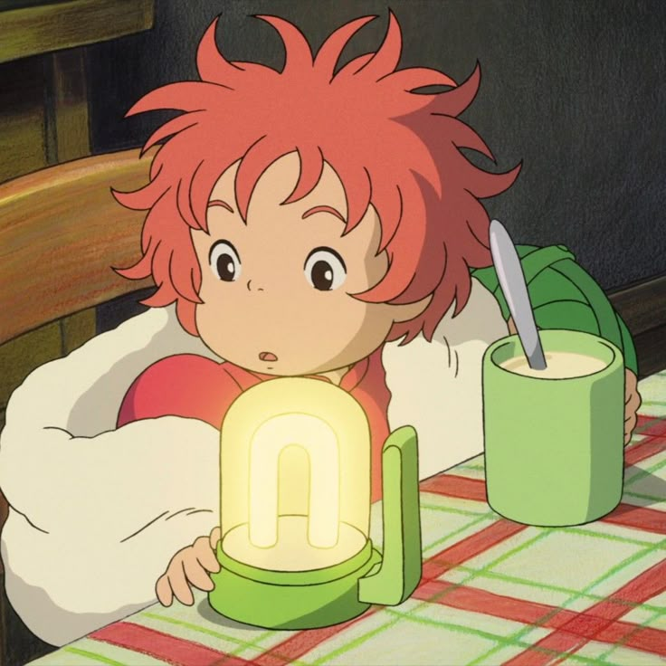

## Hi! I'm Kalani! 🌱
---
## 🔗 Links
- https://github.com/kalaniyang
---
## 🍵 About Me!
---
- 📓 GIT student @ ASU
- ☕️ Barista by Day, Designer by Night
- 💻 Interested in design, media, and web development. I enjoy learning how creativity and technology intersect, especially through visual design and front-end work. I care a lot about *why* we design things, not just how.

---
✫・。.⋆˚ੈ✩‧₊࿐࿔
---
### 🪼 Technical Skills

- Adobe Creative Suites (Illustrator & Photoshop)
- Visual Design Principles
- Typography!
---
✫・。.⋆˚ੈ✩‧₊࿐࿔
---

## 🎧 Outside of Tech
- 🏐 Volleyball + Golf 
- 🖇️ Designing Posters
- 🌊 Anything calm & creative
- 🌱 Binge Watching Studio Ghibli Movies

  

*Ponyo - My Favorite Studio Ghibli Character! 🌊*

Thank You for Stopping By! 🌸
